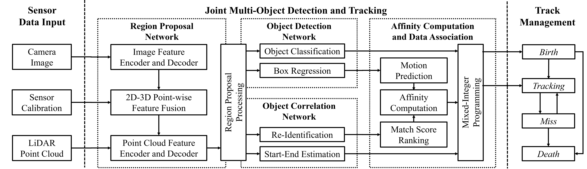
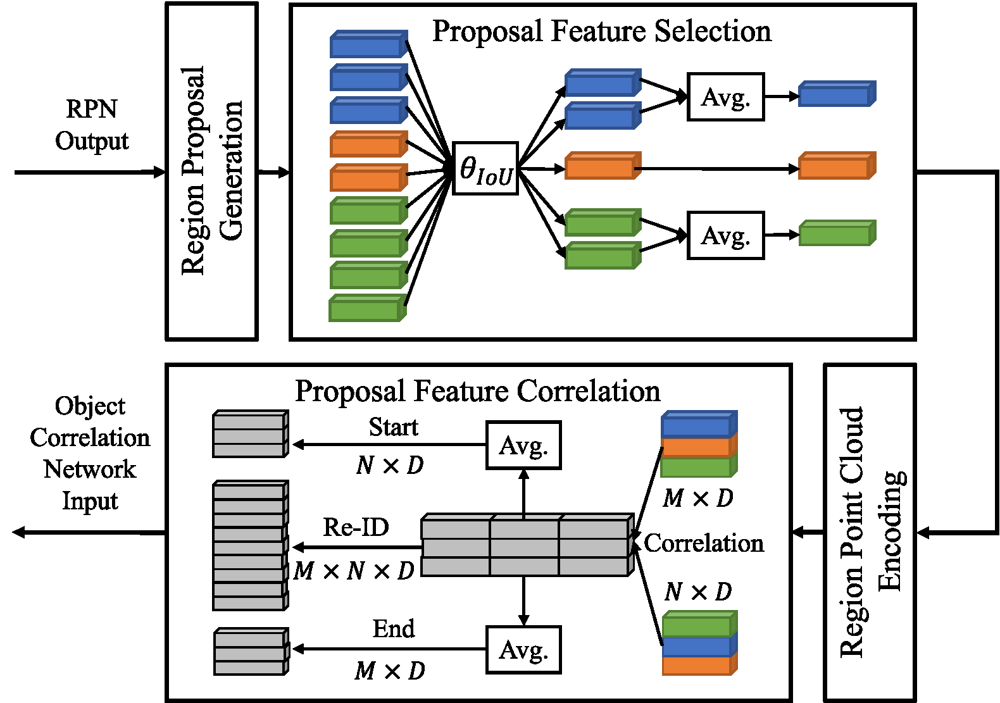

# JMODT

This is the official code release of the IROS-2021
paper [JMODT: Joint Multi-Object Detection and Tracking with Camera-LiDAR Fusion for Autonomous Driving]().

## Overview

The system architecture of JMODT:



The region proposal feature processing modules:



## Model Zoo

The results are evaluated on the validation set of the
KITTI [object tracking dataset](http://www.cvlibs.net/datasets/kitti/eval_tracking.php). Only `Car` objects are used. The average precision (AP)
scores are measured with 40 recall positions. The run time is only measured for the tracking part (after the region proposal
feature processing).

| Model                                                        | AP-Easy | AP-Moderate | AP-Hard | MOTA  | MOTP  | IDS  | FRAG | Runtime |
| ------------------------------------------------------------ | ------- | ----------- | ------- | ----- | ----- | ---- | ---- | ------- |
| [JMODT](https://drive.google.com/file/d/1HtQnGiMuhku1rs0hCn95F0UQ40wzmmE0/view?usp=sharing) | 94.01   | 87.37       | 85.22   | 86.10 | 87.13 | 0    | 129  | 0.01s   |

## Requirement

The code has been tested in the following environment:

- Ubuntu 20.04 & Windows 10
- Python 3.8
- PyTorch 1.9.0
- CUDA Toolkit 11.1

## Installation

1. Install [PyTorch](https://pytorch.org/get-started/locally/) and [CUDA](https://developer.nvidia.com/cuda-toolkit).

2. Install other required Python packages:

```shell
pip install -r requirements.txt
```

3. Build and install the required CUDA modules via PyTorch and the CUDA toolkit:

```shell
python setup.py develop
```

## Getting Started

### Dataset preparation

Please download the official KITTI [object tracking dataset](http://www.cvlibs.net/datasets/kitti/eval_tracking.php).

To generate the detection results, please use the following command to reformat the ground truth to
KITTI's [object detection](http://www.cvlibs.net/datasets/kitti/eval_object.php?obj_benchmark=3d) format. You can create
your own data splits by modifying `jmodt/config.py` file.

```shell
python tools/kitti_converter.py --data_root ${DATA_ROOT}
```

The final dataset organization should be like this (you can have your custom data root):

```
JMODT
├── data
    ├── KITTI
        ├── tracking
        │   ├──training
        │   │  ├──calib & velodyne & label_02 & image_02
        │   ├──testing
        │      ├──calib & velodyne & image_02
        ├── tracking_object
            ├──ImageSets
            │  ├──small_val.txt & test.txt & train.txt & val.txt
            ├──training
            │  ├──calib & velodyne & label_2 & image_2 & sample2frame.txt & seq2sample.txt
            ├──testing
               ├──calib & velodyne & image_2 & sample2frame.txt & seq2sample.txt
```

## Training & Testing

### Training

Finetune the additional link/start-end branches based on a pretrained detection model:

```shell
python tools/train.py --data_root ${DATA_ROOT} --ckpt ${PRETRAINED_MODEL} --finetune --batch_size ${BATCH_SIZE} --output_dir ${OUTPUT}
```

- If you want to train with multiple GPUs, add the `--mgpus` option.

- If you want to jointly train the detection and correlation models, remove the `--finetune` option.

### Testing

Evaluate the tracking performance on the validation set:

```shell
python tools/eval.py --data_root ${DATA_ROOT} --det_output ${DETECTION_OUTPUT} --ckpt ${CKPT}
```

## Visualization

Please try the code under `tools/visualization` directory to visualize your 3D object tracking results and make an
impressive video!

## License

`JMODT` is released under the MIT license.

## Acknowledgement

The object detection module of [`JMODT`](https://github.com/Kemo-Huang/JMODT) is based
on [`EPNet`](https://github.com/happinesslz/EPNet)
and [`OpenPCDet`](https://github.com/open-mmlab/OpenPCDet). The data association module is based
on [`mmMOT`](https://github.com/ZwwWayne/mmMOT). Many thanks to their official implementation.

## Citation

TODO

